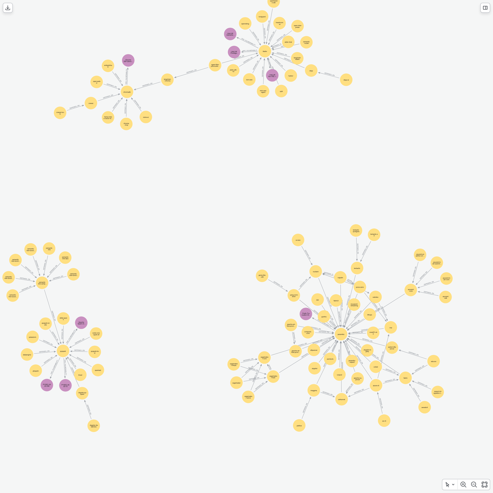

# Software Supply-Chain Dependency Mapping with Neo4j

Modern applications are assembled, not written. A typical service pulls in hundreds of open-source packages, most of them *transitively* - dependencies of dependencies that no one explicitly chose. This is exactly where supply-chain risk hides: a single vulnerable or compromised package, several layers deep, can expose an entire portfolio. Flat [SBOM](https://www.ntia.gov/SBOM) lists and conventional scanners struggle to answer the questions that actually matter at that depth.

This project models a software dependency ecosystem as a property graph in Neo4j and uses it to answer those questions directly: *what is the blast radius of a compromised package? which dependencies are load-bearing single points of failure? what is being actively exploited right now? and what licensing obligations are we inheriting without knowing it?* By representing dependencies, vulnerabilities, source projects, and licenses as a connected graph, structural and real-world risk that a flat list would miss becomes a single Cypher query away.

<p align="center">
  
  <br>
  <sub>The graph schema: <code>Package</code> nodes depend on one another and link out to their <code>Vulnerability</code>, source <code>Project</code>, and <code>License</code>.</sub>
</p>

# The Background

Software composition analysis is a cornerstone of modern application security. As organisations adopt Software Bill of Materials (SBOM) practices, they need more than an inventory - they need to understand the *relationships* between components. Vulnerabilities are inherited transitively, licensing obligations propagate through the dependency tree, and the failure of one widely-depended-upon package ripples across everything built on top of it.

A graph is the natural representation for this problem. Where a relational schema forces expensive recursive joins to traverse a dependency tree, a graph traverses those same relationships natively - making transitive blast-radius, shortest-path-to-remediation, and centrality analyses both expressive and fast. This project demonstrates that approach end-to-end, from data collection through to a set of practical security and compliance use cases.

# The Stack

- **[Neo4j](https://neo4j.com/)** - the graph database storing packages, vulnerabilities, projects, and licenses.
- **[deps.dev](https://deps.dev/)** - Google's open-source dependency dataset and API, the primary source of the dependency graph and vulnerability advisories.
- **Python** - data collection, ETL, and analysis, orchestrated through Jupyter notebooks.
- **[neo4j-viz](https://pypi.org/project/neo4j-viz/)** + **[Playwright](https://playwright.dev/python/)** - rendering force-directed graph visualisations to PNG.
- **pandas / matplotlib / seaborn** - tabular analysis and charting.

# The Dataset

The dependency graph is crawled from the **[deps.dev](https://deps.dev/) public API**, starting from a configurable set of seed packages and walking their dependency trees breadth-first to a configurable depth. On top of this structural backbone, the graph is enriched with four external signals that turn raw structure into actionable security and compliance intelligence:

| Source | What it adds | Used for |
| --- | --- | --- |
| **[deps.dev](https://deps.dev/)** | Dependency edges, version metadata, security advisories (CVE/CVSS) | The core dependency + vulnerability graph |
| **[EPSS](https://www.first.org/epss/)** (FIRST.org) | Probability (0-1) a CVE will be exploited in the wild | Real-world risk prioritisation |
| **[CISA KEV](https://www.cisa.gov/known-exploited-vulnerabilities-catalog)** | Catalog of vulnerabilities *known to be actively exploited* | "Patch this now" flagging |
| **[SPDX licenses](https://spdx.org/licenses/)** (via deps.dev) | The declared license of each package version | License compliance & exposure |
| **[OpenSSF Scorecard](https://securityscorecards.dev/)** (via deps.dev) | Repository security-posture score (0-10) | Maintainer-health analysis |

> **Note:** EPSS scores and the CISA KEV catalog change daily, but API responses are cached on disk under `.cache/` and never expire. Clear the relevant cache entries (or the whole directory) when you need a fresh pull.

# The Graph Model

## Nodes

| Label | Key properties | Description |
| --- | --- | --- |
| `Package` | `name` | A software package (e.g. a PyPI distribution). |
| `Vulnerability` | `advisory_id`, `cve_id`, `cvss3_score`, `cvss3_vector`, `title`, `url`, `epss_score`, `epss_percentile`, `in_kev`, `kev_date_added`, `kev_due_date`, `kev_ransomware` | A security advisory affecting one or more packages, enriched with EPSS and CISA KEV exploitation signals. |
| `License` | `spdx_id` | An [SPDX](https://spdx.org/licenses/) license identifier (e.g. `MIT`, `Apache-2.0`, `non-standard`). |
| `Project` | `id`, `repo_url`, `stars`, `forks`, `open_issues`, `license`, `scorecard_score`, `scorecard_date` | The source repository a package is published from, enriched with its OpenSSF Scorecard. |

## Relationships

| Relationship | Properties | Description |
| --- | --- | --- |
| `(:Package)-[:DEPENDS_ON]->(:Package)` | `semver_requirement`, `source_version`, `target_version` | A dependency edge between two package versions. |
| `(:Package)-[:HAS_VULNERABILITY]->(:Vulnerability)` | `version` | The package version affected by a vulnerability. |
| `(:Package)-[:HAS_LICENSE]->(:License)` | `version` | The license a package version declares. |
| `(:Package)-[:PUBLISHED_FROM]->(:Project)` | - | Links a package to its source repository. |

# Notebooks

The project is split into two notebooks: one to **build** the graph, and one to **analyse** it.

## Data Loader & ETL - `loader.ipynb`

Crawls deps.dev breadth-first from the seed packages, scans every discovered package-version for vulnerabilities, enriches them with EPSS and CISA KEV signals, extracts per-version licenses and per-project OpenSSF Scorecards, and loads everything into Neo4j with appropriate uniqueness constraints. All network calls are cached on disk so re-runs are cheap.

## Analysis - `analysis.ipynb`

Explores a series of supply-chain security and compliance use cases. Each renders both a tabular result and a force-directed graph visualisation.

**Transitive blast radius** - given a target package, how far does its compromise propagate? The query accumulates affected dependents hop-by-hop across the upstream dependency tree.

<p align="center">
  
  <br>
  <sub>Packages within three hops upstream of <code>urllib3</code> - everything that inherits its risk.</sub>
</p>

**Transitive security risk scoring** - the aggregate "security debt" a candidate library drags in across its entire transitive tree. A library with *zero direct* CVEs can still inherit dozens.

<p align="center">
  
  <br>
  <sub>Candidate libraries (highlighted) and the vulnerabilities reachable through their dependency trees.</sub>
</p>

**Exploitation-aware prioritisation (EPSS + CISA KEV)** - moves beyond raw CVSS severity to rank vulnerabilities by what is *actually being exploited*, using EPSS exploitation probability and the CISA KEV catalog.

<p align="center">
  
  <br>
  <sub>The most-likely-exploited vulnerabilities (highest EPSS), the packages that carry them, and the dependents that inherit the exposure.</sub>
</p>

**Supply-chain centrality** - ranks packages by number of dependents to identify the load-bearing libraries whose compromise would ripple furthest - the single points of failure most deserving of auditing or funding.

<p align="center">
  
  <br>
  <sub>The "hub" star around the single most depended-upon package in the graph.</sub>
</p>

**Maintainer health (OpenSSF Scorecard)** - cross-references centrality with the OpenSSF Scorecard of each package's source project to surface the fragile single points of failure: heavily depended-upon *and* poorly maintained.

**Dependency version conflict detection** - finds packages pulled in at multiple conflicting versions across the graph - a common source of subtle, hard-to-debug failures.

<p align="center">
  
  <br>
  <sub>A package required at conflicting versions by different parents.</sub>
</p>

**Shortest path to remediation** - from a vulnerable application, finds the shortest dependency path to each critical vulnerability and groups them by first hop, telling a developer *which single direct dependency to bump* to eliminate the most risk.

<p align="center">
  
  <br>
  <sub>Shortest paths from a root application to its critical vulnerabilities.</sub>
</p>

**Circular dependency detection** - surfaces dependency cycles, which complicate builds, upgrades, and reasoning about the graph.

<p align="center">
  
  <br>
  <sub>The tightest dependency cycles in the graph.</sub>
</p>

**Zero-trust verification (typosquat detection)** - heuristically flags low-trust packages whose names closely resemble popular ones - a common supply-chain attack vector.

<p align="center">
  
  <br>
  <sub>Popular packages alongside their low-trust name-alikes.</sub>
</p>

**License compliance & transitive exposure** - profiles the license distribution across the graph and walks an application's transitive tree to flag inherited copyleft or unidentified licenses - a genuine legal and compliance hazard.

# Setup & Configuration

## Prerequisites

- A running **Neo4j** instance (local, Docker, or [Aura](https://neo4j.com/cloud/aura/)).
- **[Conda](https://docs.conda.io/)** (or Miniconda) for environment management.
- Network access to the deps.dev, FIRST.org (EPSS), and CISA (KEV) APIs.

## Environment Variables

Create a `.env` file in the project root:

```bash
# Neo4j connection
NEO4J_URI=bolt://localhost:7687
NEO4J_USERNAME=neo4j
NEO4J_PASSWORD=your-password
NEO4J_DATABASE=neo4j

# Crawl configuration
SEED_PACKAGES=requests,flask,fastapi,mlflow   # comma-separated seed packages
SEED_SYSTEM=pypi                              # deps.dev ecosystem (e.g. pypi, npm, maven)
SEED_DEPTH=2                                  # how many dependency hops to crawl

# Analysis output
RENDER_DIR=renderings                         # where rendered graph PNGs are written
```

## Installation

Create and activate the conda environment, then install the Playwright browser used for rendering:

```bash
conda env create -f environment.yml
conda activate cyber-software-dependency-mapping
playwright install chromium
```

## Running the Pipeline

1. **Build the graph** - run `loader.ipynb` end-to-end. It crawls deps.dev, enriches with EPSS / KEV / license / Scorecard data, and loads everything into Neo4j. First runs populate the on-disk `.cache/`; subsequent runs are fast.
2. **Analyse the graph** - run `analysis.ipynb`. It connects to Neo4j and works through the use cases above, writing graph visualisations to the `renderings/` directory.
