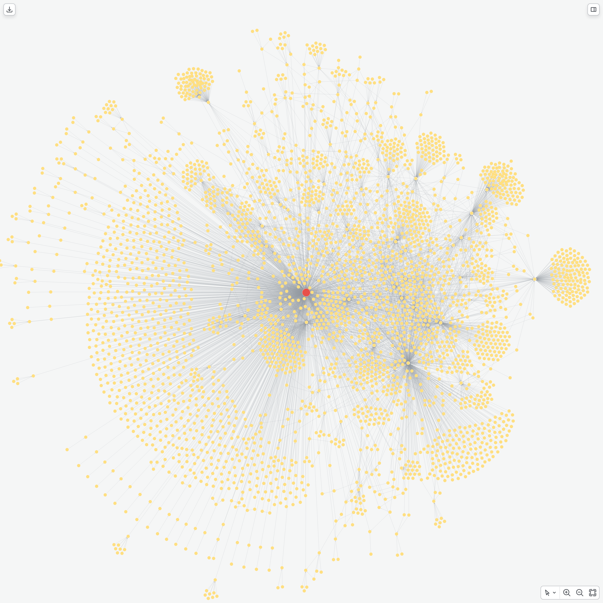

# Software Dependency Graph
### Transitive Risk and Supply Chain Analysis in Neo4j
**Cybersecurity Use Cases: From flat SBOMs to graph-based intelligence**
*Based on: [pedroleitao-neo4j/cyber-software-dependency-mapping](https://github.com/pedroleitao-neo4j/cyber-software-dependency-mapping)*

---

# The Problem: Hidden Transitive Risks
### Modern software relies on complex chains of open-source packages.
- **Flat SBOM Blindspot:** Traditional security scanners generate flat lists of software components but fail to capture how they relate to one another.
- **Hidden Vulnerabilities:** A security flaw buried three or four levels deep in a transitive dependency remains invisible to simple scans.
- **Untargeted Remediation:** Without mapping relationships, developers waste effort patching packages that pose no active threat.

---

# What is Software Dependency Mapping?
### It transforms flat software inventory into relationship-aware graph intelligence.
- **Dependency Tracking:** Tracks version requirements and actual resolved versions across package ecosystems.
- **Vulnerability Linkage:** Automatically maps known security advisories to the specific package versions they affect.
- **Graph-Powered Security:** Enables immediate assessment of downstream impact, version conflicts, architectural loops, and typosquatting.

---

# Core Architecture
### The ingestion and analysis workflow
- **Data Ingestion:** A Python script in the loader notebook fetches dependency networks recursively from the deps.dev API and imports them into Neo4j.
- **Graph Queries:** The analysis notebook runs Cypher queries to evaluate security debt, identify load-bearing packages, and optimize remediation.
- **Visualization:** Utilizes Playwright and the neo4j-viz library to export high-definition renderings of the dependency structures.

---

# Data Integration Layers
### The three domains mapped in our Neo4j model:

| Layer | Source | Key Entities |
| :--- | :--- | :--- |
| **Software Packages** | deps.dev API | Package names, package versions, and dependencies |
| **Vulnerability Intel** | deps.dev / OSV | Advisory IDs, CVE IDs, titles, and CVSS scores |
| **Dependency Edges** | deps.dev API | Semantic version requirements and resolved versions |

---

# Ingestion Snapshot
### How packages and vulnerabilities are loaded into Neo4j:
- **BFS Crawling:** Performs a breadth-first search starting from seed packages up to a configurable depth.
- **Advisory Matching:** Resolves package version keys to retrieve security advisory details and CVSS metrics.
- **Idempotent Storage:** Uses batched Cypher merge statements and database constraints to ensure data consistency.

---

# The Resulting Schema
### Connecting packages, versions, and security vulnerabilities
- The graph model features packages that depend on other packages and point to their respective vulnerabilities.
- 

---

# Use Case 1: Transitive Blast Radius
### Identify the full downstream impact of a compromised package.
- **The Query:** Traverses dependencies in reverse to find all packages that depend on a target library either directly or transitively.
- **The Insight:** Surfacing the full blast radius reveals the true extent of exposure across the dependency graph.
- 

---

# Use Case 2: Transitive Security Risk Scoring
### Calculate the aggregate security debt of a package.
- **The Query:** Walks the transitive dependency tree for candidate libraries and accumulates the CVSS scores of all reachable vulnerabilities.
- **The Insight:** Highlights how a library with no direct vulnerabilities can still introduce significant security risks transitively.
- 

---

# Use Case 3: Supply Chain Centrality
### Identify load-bearing dependencies in the ecosystem.
- **The Query:** Ranks packages by their dependent count to locate single points of failure in the software chain.
- **The Insight:** Points out the critical libraries that warrant the most rigorous security audits and code reviews.
- 

---

# Use Case 4: Dependency Version Conflict Detection
### Resolve conflicting package requirements across the build environment.
- **The Query:** Scans for packages that are requested under multiple different versions or requirement strings.
- **The Insight:** Helps developers identify and fix version mismatches that cause build failures or runtime bugs.
- 

---

# Use Case 5: Shortest Path to Remediation
### Find the most efficient upgrade path to patch critical vulnerabilities.
- **The Query:** Identifies the shortest dependency path from a root application to packages hosting critical vulnerabilities.
- **The Insight:** Tells developers exactly which direct dependency to bump to eliminate the maximum amount of security risk.
- 

---

# Use Case 6: Circular Dependency Detection
### Detect architectural smells that cause brittle builds and cyclic imports.
- **The Query:** Searches for dependency cycles where a package transitively depends on itself.
- **The Insight:** Flags architectural patterns that lead to circular dependencies and compilation issues.
- 

---

# Use Case 7: Typosquat Detection
### Identify suspicious name-alikes using string distance metrics.
- **The Query:** Leverages APOC text functions to find packages with names close to popular libraries but with low dependent counts.
- **The Insight:** Automatically flags typosquatting attempts and other potential software supply chain attacks.
- 
