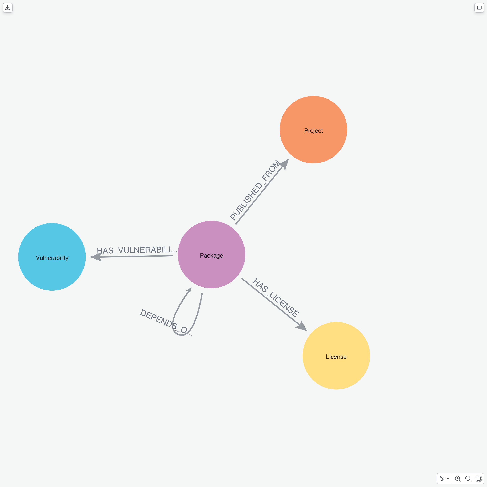
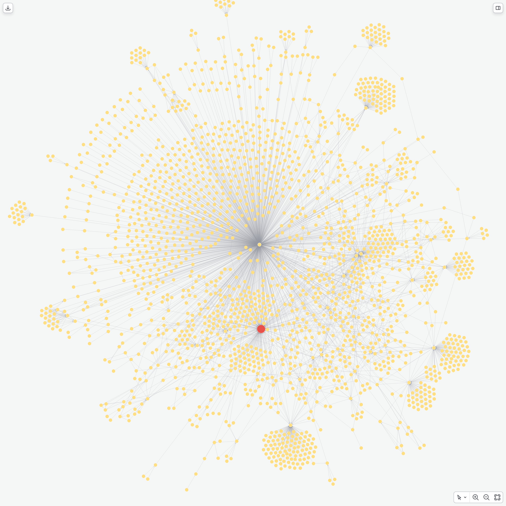
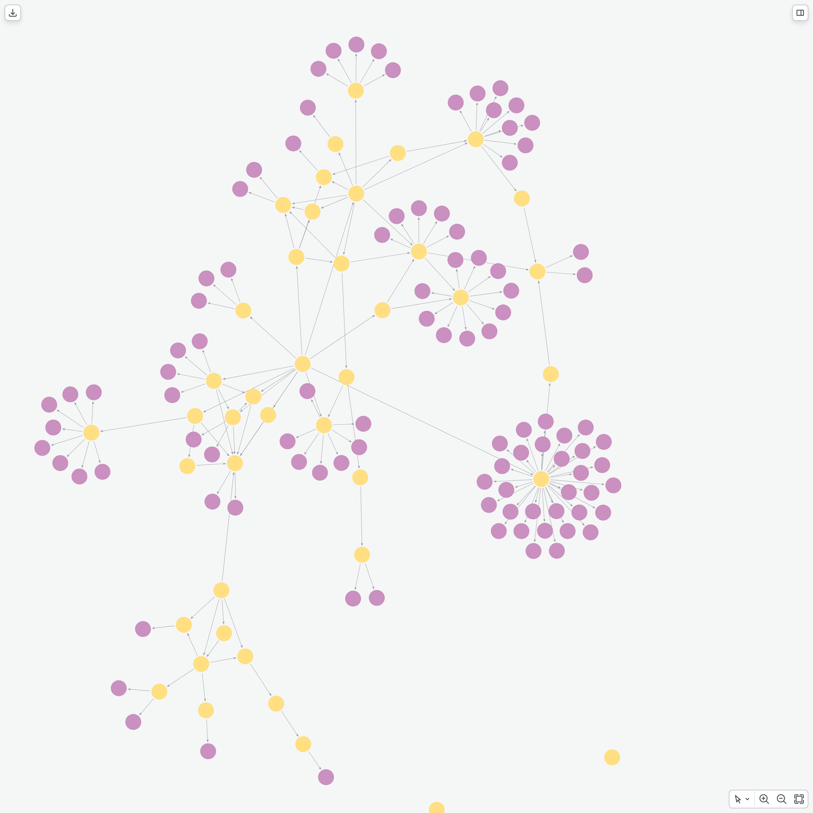
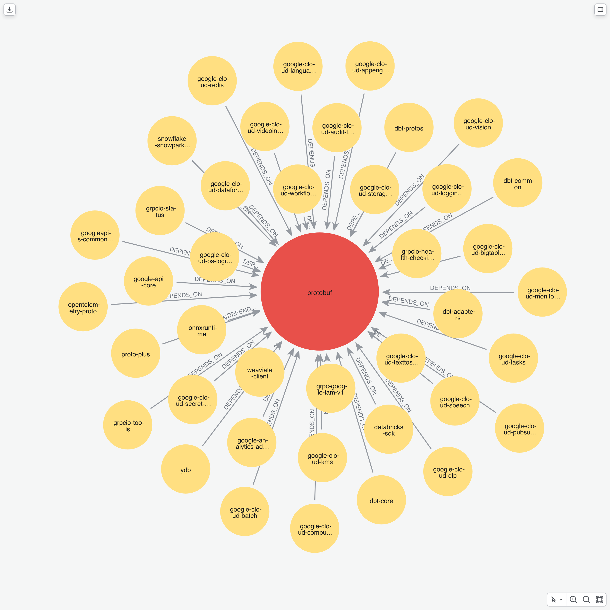
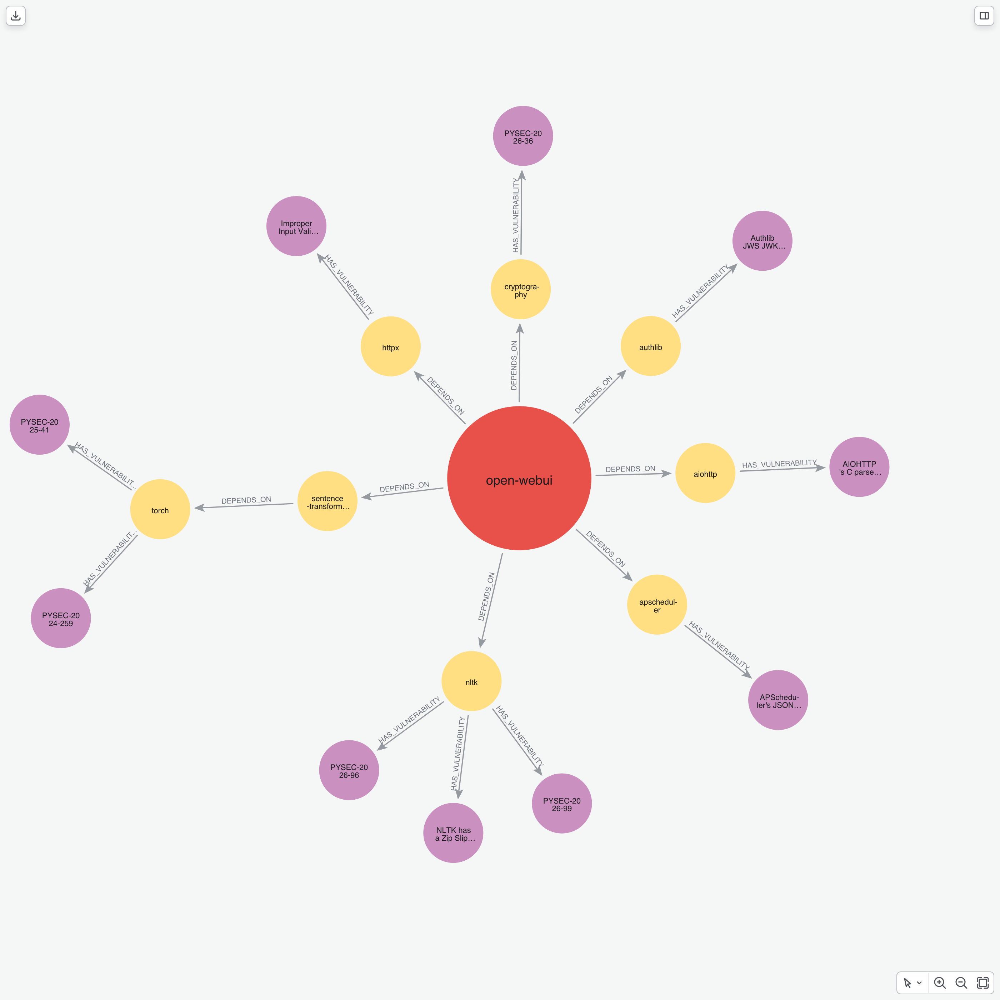
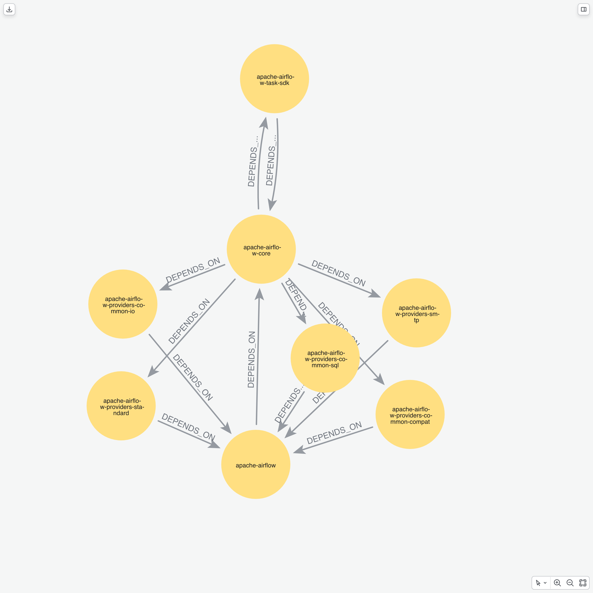
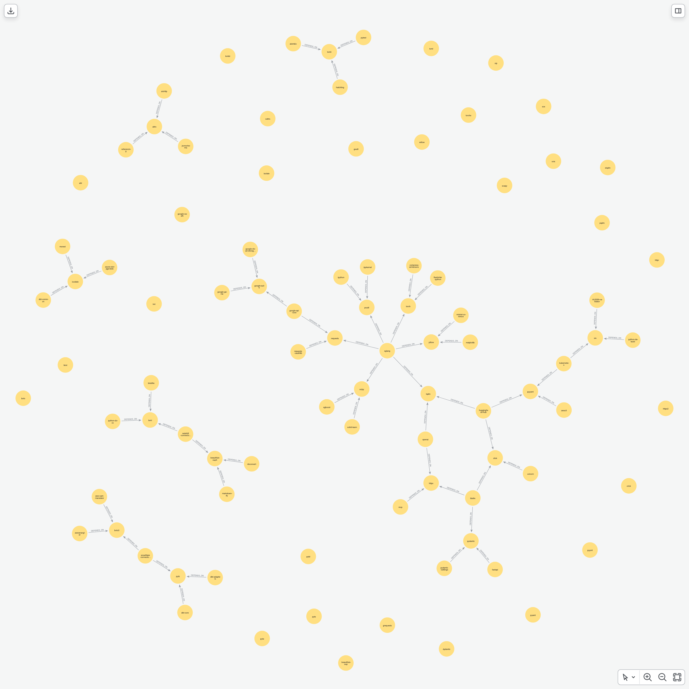

# Software Dependency Graph
### Transitive Risk and Supply Chain Analysis in Neo4j
**Cybersecurity Use Cases: From flat SBOMs to graph-based intelligence**
*Based on: [pedroleitao-neo4j/cyber-software-dependency-mapping](https://github.com/pedroleitao-neo4j/cyber-software-dependency-mapping)*

---

# The Industry Problem: Software Supply Chain Risks
### Modern enterprise applications are assembled from hundreds of open-source packages, introducing systemic vulnerabilities.
Compliance mandates like the US Cyber Executive Order 14028 and the EU Cyber Resilience Act force businesses to track software inventories, yet static and flat SBOMs fail to reveal deep dependency relationships.

High-profile exploits like Log4j demonstrate that security flaws buried deep in transitive dependencies remain invisible to traditional scanning tools.

Organizations face alert fatigue and waste millions in developer productivity trying to patch unreachable vulnerabilities, lacking the relationship intelligence needed for impact analysis.

---

# The Business Solution: Graph-Based Dependency Mapping
### Transforming flat software inventories into actionable security and compliance intelligence.
By modeling package ecosystems as a property graph in Neo4j, organizations can map version requirements, vulnerability disclosures, and licensing metadata into a single source of truth.

Security teams can immediately prioritize remediation by tracing exploitation probability and identifying whether a vulnerability is actually reachable in their runtime environment.

This graph-powered approach enables proactive risk management, helping organizations avoid operational disruption and verify the health and compliance of their supply chain.

---

# Data Integration Layers
### The three domains mapped in our Neo4j model:

| Layer | Source | Key Entities |
| :--- | :--- | :--- |
| **Software Packages** | deps.dev API | Package names, package versions, and dependencies |
| **Vulnerability Intel** | deps.dev / OSV | Advisory IDs, CVE IDs, titles, and CVSS scores |
| **Dependency Edges** | deps.dev API | Semantic version requirements and resolved versions |

---

# Ingestion Snapshot
### How packages and vulnerabilities are loaded into Neo4j:
- **BFS Crawling:** Performs a breadth-first search starting from seed packages up to a configurable depth.
- **Advisory Matching:** Resolves package version keys to retrieve security advisory details and CVSS metrics.
- **Idempotent Storage:** Uses batched Cypher merge statements and database constraints to ensure data consistency.

---

# The Resulting Schema
### Connecting packages, versions, and security vulnerabilities

- The graph model features packages that depend on other packages and point to their respective vulnerabilities.

---

# Use Case 1: Transitive Blast Radius
### Identify the full downstream impact of a compromised package.

- **The Query:** Traverses dependencies in reverse to find all packages that depend on a target library either directly or transitively.
- **The Insight:** Surfacing the full blast radius reveals the true extent of exposure across the dependency graph.

---

# Use Case 2: Transitive Security Risk Scoring
### Calculate the aggregate security debt of a package.

- **The Query:** Walks the transitive dependency tree for candidate libraries and accumulates the CVSS scores of all reachable vulnerabilities.
- **The Insight:** Highlights how a library with no direct vulnerabilities can still introduce significant security risks transitively.

---

# Use Case 3: Supply Chain Centrality
### Identify load-bearing dependencies in the ecosystem.

- **The Query:** Ranks packages by their dependent count to locate single points of failure in the software chain.
- **The Insight:** Points out the critical libraries that warrant the most rigorous security audits and code reviews.

---

# Use Case 4: Dependency Version Conflict Detection
### Resolve conflicting package requirements across the build environment.

- **The Query:** Scans for packages that are requested under multiple different versions or requirement strings.
- **The Insight:** Helps developers identify and fix version mismatches that cause build failures or runtime bugs.

---

# Use Case 5: Shortest Path to Remediation
### Find the most efficient upgrade path to patch critical vulnerabilities.

- **The Query:** Identifies the shortest dependency path from a root application to packages hosting critical vulnerabilities.
- **The Insight:** Tells developers exactly which direct dependency to bump to eliminate the maximum amount of security risk.

---

# Use Case 6: Circular Dependency Detection
### Detect architectural smells that cause brittle builds and cyclic imports.

- **The Query:** Searches for dependency cycles where a package transitively depends on itself.
- **The Insight:** Flags architectural patterns that lead to circular dependencies and compilation issues.

---

# Use Case 7: Typosquat Detection
### Identify suspicious name-alikes using string distance metrics.

- **The Query:** Leverages APOC text functions to find packages with names close to popular libraries but with low dependent counts.
- **The Insight:** Automatically flags typosquatting attempts and other potential software supply chain attacks.
